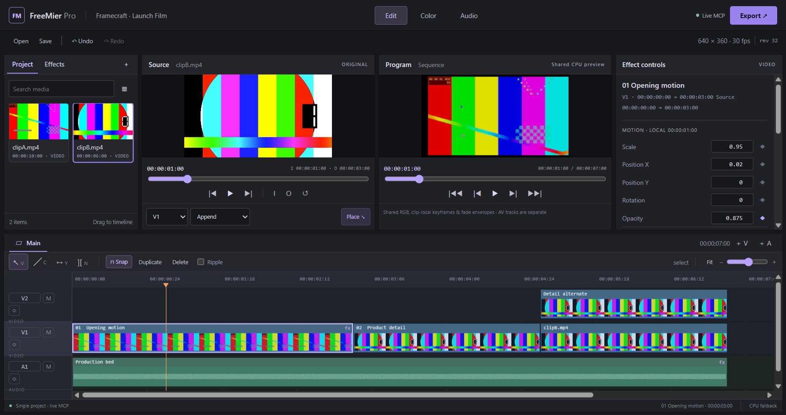

# FreeMier Pro

An independent, open-source video editor that an MCP agent and a person can operate together. The Electron interface and standard MCP server edit one project store, so agent changes appear live in the timeline and preview.

The workspace has Source and Program monitors, a multitrack timeline, effect controls and dedicated Color and Audio panels. The implementation is MIT-licensed. See the [development roadmap](ROADMAP.md) and [folder structure](FOLDER-STRUCTURE.md) and [simple code guide](docs/CODE-GUIDE.md).

The development build exposes **94 MCP tools**. Its checks include **377 tests, 40 baseline live Electron checks, a standalone font check and five additional desktop acceptance suites**. It supports persistent workspace settings and named layouts, source-handle-aware video dissolves and audio crossfades, project bins, descriptive metadata, media search/filter/sort/paging, file checks and explicit relink, aligned linked video/audio edits, visible project/settings/track controls, slip/roll/duplicate, track locks, transform keyframes/easing, seven rendered effects, independent Source ranges, markers, styled titles, editable SRT captions, portable copied-media save/load and descriptive effect-preset imports. Project validation protects load/save/history/export boundaries. See [supported features and limitations](docs/STATUS.md) and the [27-area completion tracker](docs/FEATURE-COMPLETION.md).

This is a developer source preview. Production readiness, installation and real-footage acceptance gates are tracked in [release readiness](docs/RELEASE-READINESS.md).

The Presets library imports portable `.fmfx.json` stacks with descriptions, control schemas, tags, content identities and explicit compatibility limits. Agents can inspect/import/search/apply/capture/export/remove them through standard MCP, and GUI controls use the same store. See the [preset format and commands](docs/PRESETS.md). Wider import support is planned. [Project media organisation](docs/MEDIA-ORGANISATION.md) describes bins, identity checks, relink commands and their limits.



## Run locally

Install Node.js 24, npm, and FFmpeg/ffprobe on PATH. FFmpeg must include the encoders you want to export with, such as libx264 or libx265, and `drawtext`/FreeType for titles. Noto Sans Regular is bundled with its [OFL license and checksum](assets/fonts/README.md); no system-font substitution or runtime font download occurs.

```sh
npm ci
npm run build
npm run gui
```

The GUI opens a standalone project when no matching MCP bridge is running. To have an agent and the GUI operate the same project, start the MCP server through your harness first, then launch the GUI with the same workspace and bridge port.

## Connect an MCP harness

Merge [examples/mcp.json](examples/mcp.json) into your harness configuration, replacing its two absolute paths. FreeMier uses standard MCP over stdio; protocol output is reserved for MCP messages.

```json
{
  "mcpServers": {
    "freemier-pro": {
      "command": "node",
      "args": ["/absolute/path/FreeMier-Pro/packages/mcp/dist/cli.js"],
      "env": {
        "FREEMIER_WORKSPACE": "/absolute/path/FreeMier-workspace",
        "FREEMIER_BRIDGE_PORT": "4317"
      }
    }
  }
}
```

Launch the GUI from a terminal using the matching settings. On Windows PowerShell:

```powershell
$env:FREEMIER_WORKSPACE = 'C:\path\to\FreeMier-workspace'
$env:FREEMIER_BRIDGE_PORT = '4317'
npm run gui
```

On Linux:

```sh
FREEMIER_WORKSPACE=/path/to/FreeMier-workspace FREEMIER_BRIDGE_PORT=4317 npm run gui
```

An agent can create/load a project, import media, inspect the timeline, add tracks/clips, edit, undo, save, and export. Use `tools/list` to discover the current tool schemas. Use `clip_add_linked` to place picture and sound from one audio-bearing video as an aligned pair. The GUI uses this by default for video sources; independent placement remains explicit. See [linked editing and its limits](docs/LINKED-MEDIA.md). `project_save` packages copied imports inside the saved project directory; referenced imports retain their external paths. Move the entire saved directory for a copied-media project.

For Codex CLI, the equivalent registration command is:

```sh
codex mcp add freemier-pro --env FREEMIER_WORKSPACE=/absolute/path/FreeMier-workspace --env FREEMIER_BRIDGE_PORT=4317 -- node /absolute/path/FreeMier-Pro/packages/mcp/dist/cli.js
```

Quote paths containing spaces. JSON configuration and Codex registration are alternative harness setup methods; the real stdio integration test verifies the protocol independently of a client UI.

The bridge listens on loopback. Match the bridge port to the project; use separate workspaces and ports for independent editing sessions. Start MCP before the GUI so the MCP process owns the shared store.

## Development and verification

```sh
npm run fixtures
npm run check:structure
npm run build
npm test
npm run test:gui
```

Fixtures are synthetic media generated locally. The GUI acceptance test launches real Electron, drives a real stdio MCP session, checks live synchronization and decoded preview frames, operates the controls, and exports and probes media. Native dialog selections are substituted only in the test harness. Generated media, local project files, and private test evidence are excluded from Git.

The [GitHub workflow](https://github.com/LikithMeruvu/FreeMier-Pro/actions/workflows/verify.yml) runs the build, tests and real Electron checks on Linux/Xvfb. Title/caption preview and burn-in share rendered RGBA glyphs. Caption export supports burn-in, none and an SRT sidecar without changing authored sequence duration. Media preview uses shared RGB/easing/fade processing and Web Audio gain; blur/sharpen remain spatial approximations of FFmpeg kernels. Passing these checks does not establish production readiness.

## Scope

FreeMier Pro is under active development. Transitions, LUTs, arbitrary font imports, animated templates, proxies, multicam, interchange, richer grading/mixing, local AI and GPU rendering remain planned. Native vendor projects and executable effect/audio plugins are not supported. See the [roadmap](ROADMAP.md) and [release requirements](docs/RELEASE-READINESS.md) before choosing it for an editing job.
